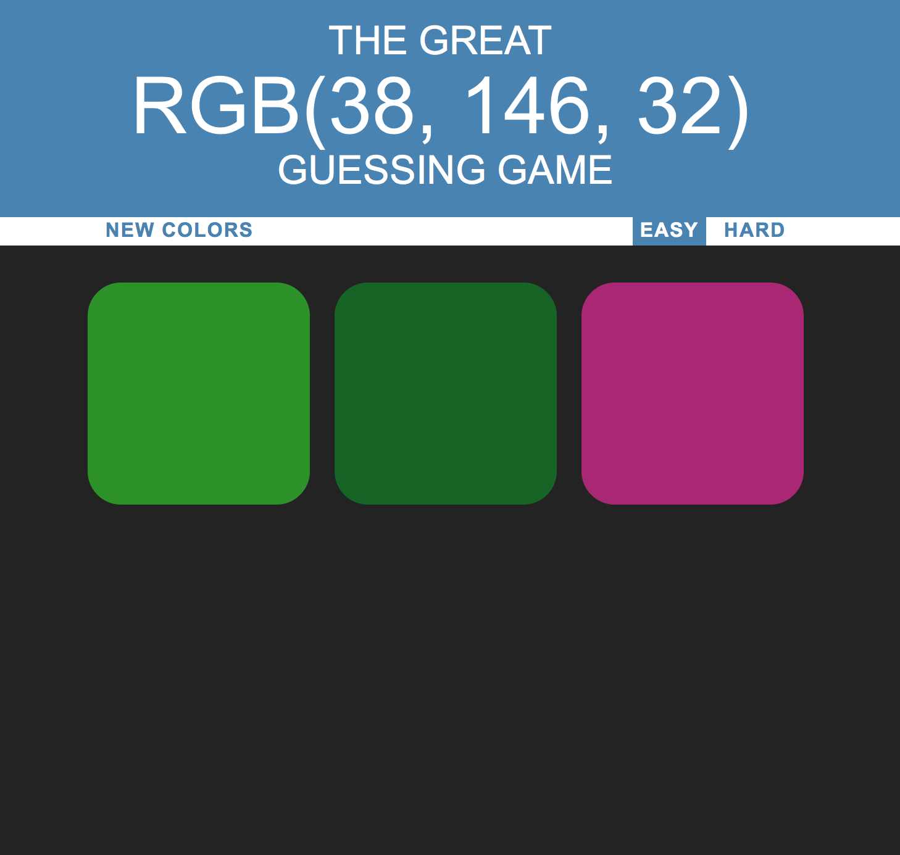

# Octa-Color-Gamey

Octa-Color-Gamey is a webpage that challengers the user to guess which color is equivalent to the RGB provided code.

## Set Up

Open your terminal

Navigate to your desktop with `cd Desktop`

Clone the repository with `git clone` https://github.com/octacode/Octa-color-Gamey.git

Navigate to the directory with `cd Octa-Color-Gamey`

Run the program in your preferred browser with `open colorgame.html`

## Built With

* [JavaScript]
* [CSS]
* [HTML]

## Contributing

Please read visit (https://github.com/octacode/Octa-color-Gamey) for details on our code of conduct, and the process for submitting pull requests to us.

## Authors

* **Kumar Shashwat** - *Initial work* - [octacode](https://github.com/octacode)

See also the list of [contributors](https://github.com/octacode/Octa-color-Gamey/graphs/contributors) who participated in this project.

## License

Copyright (c) 2017 Kumar Shashwat
This project is licensed under the MIT License
